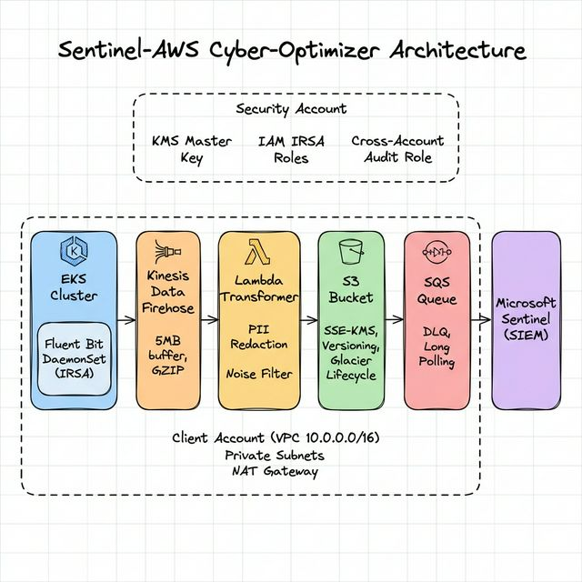

# 🛡️ Sentinel-AWS Cyber-Optimizer

> **Automated Security-as-Code Pipeline for Multi-Tenant Log Optimization & Supply Chain Risk Management**

[](/.github/workflows/ci-cd-pipeline.yml)
[](./terraform/)
[](./kubernetes/)
[](/.github/workflows/ci-cd-pipeline.yml)

---

## 📋 Table of Contents

- [Overview](#overview)
- [Architecture](#architecture)
- [Project Structure](#project-structure)
- [Components](#components)
- [Deployment Guide](#deployment-guide)
- [Security Features](#security-features)
- [Cost Optimization](#cost-optimization)
- [CI/CD Pipeline](#cicd-pipeline)

---

## Overview

Sentinel-AWS Cyber-Optimizer is an enterprise-grade cloud security system that demonstrates:

| Capability | Implementation |
|---|---|
| **Multi-Tenant Architecture** | Simulated multi-account AWS with provider aliases + per-tenant S3 prefixes |
| **FinOps Optimization** | Lambda log transformer reduces SIEM ingestion costs by filtering noise logs |
| **Workload Identity** | OIDC-based IRSA — zero hardcoded credentials in Kubernetes |
| **Supply Chain Security** | Trivy vulnerability scanning + Syft SBOM generation (CycloneDX) |
| **Compliance-as-Code** | Checkov policy enforcement with automated pipeline gating |
| **SIEM Integration** | S3 → SQS event bridge for Microsoft Sentinel ingestion |

---

## Architecture



<details>
<summary>Text-based architecture reference (click to expand)</summary>

```
┌─────────────────────────────────────────────────────────────────────┐
│                        SECURITY ACCOUNT                             │
│  ┌──────────┐  ┌──────────┐  ┌──────────────────────────────────┐  │
│  │   KMS    │  │ IAM Roles│  │  Security Audit Role             │  │
│  │ (Master) │  │ (IRSA)   │  │  (Cross-Account Read Access)     │  │
│  └──────────┘  └──────────┘  └──────────────────────────────────┘  │
└─────────────────────────────────────────────────────────────────────┘
                              │
                              ▼
┌─────────────────────────────────────────────────────────────────────┐
│                        CLIENT ACCOUNT                               │
│                                                                     │
│  ┌─────────────────────────────────────────────────────────────┐   │
│  │                    VPC (10.0.0.0/16)                         │   │
│  │  ┌─────────────┐  ┌─────────────┐                          │   │
│  │  │Public Subnet│  │Public Subnet│  ← NAT Gateway            │   │
│  │  │  10.0.101/24│  │  10.0.102/24│                          │   │
│  │  └─────────────┘  └─────────────┘                          │   │
│  │  ┌─────────────┐  ┌─────────────┐                          │   │
│  │  │Priv. Subnet │  │Priv. Subnet │  ← EKS Node Groups       │   │
│  │  │  10.0.1/24  │  │  10.0.2/24  │                          │   │
│  │  └─────┬───────┘  └─────┬───────┘                          │   │
│  └────────┼────────────────┼───────────────────────────────────┘   │
│           │                │                                        │
│  ┌────────▼────────────────▼───────────────────────────────────┐   │
│  │                EKS Cluster (Private)                         │   │
│  │  ┌─────────────────────────────────────┐                    │   │
│  │  │  Fluent Bit DaemonSet (IRSA)        │                    │   │
│  │  │  - Tail container logs              │                    │   │
│  │  │  - K8s metadata enrichment          │                    │   │
│  │  │  - Health check noise filtering     │                    │   │
│  │  └─────────────┬───────────────────────┘                    │   │
│  └────────────────┼────────────────────────────────────────────┘   │
│                   │                                                  │
│                   ▼                                                  │
│  ┌────────────────────────────────────────────────────────────────┐ │
│  │              Kinesis Data Firehose                              │ │
│  │  Buffering: 5MB / 60s │ Compression: GZIP                     │ │
│  └────────────┬───────────────────────────────────────────────────┘ │
│               │                                                      │
│               ▼                                                      │
│  ┌────────────────────────────────────────────────────────────────┐ │
│  │           Lambda Log Transformer                                │ │
│  │  ┌──────────────┐  ┌──────────────┐  ┌──────────────┐        │ │
│  │  │ PII Redaction │  │Noise Filter  │  │ Enrichment   │        │ │
│  │  │ - SSN         │  │ - Drop 2XX   │  │ - Metadata   │        │ │
│  │  │ - Credit Card │  │ - Keep 4XX   │  │ - Timestamps │        │ │
│  │  │ - Email       │  │ - Keep 5XX   │  │ - Pipeline   │        │ │
│  │  │ - IPv4        │  │ - Keep SecEv │  │              │        │ │
│  │  │ - AWS Keys    │  │              │  │              │        │ │
│  │  └──────────────┘  └──────────────┘  └──────────────┘        │ │
│  └────────────┬───────────────────────────────────────────────────┘ │
│               │                                                      │
│               ▼                                                      │
│  ┌────────────────────────┐    ┌──────────────────────┐            │
│  │   S3 Bucket (Encrypted)│───▶│  SQS Queue           │            │
│  │   - SSE-KMS            │    │  - Event Notification │            │
│  │   - Versioning         │    │  - Dead Letter Queue  │            │
│  │   - Lifecycle (Glacier)│    │  - Long Polling       │            │
│  │   - Per-tenant prefixes│    └──────────┬───────────┘            │
│  └────────────────────────┘               │                         │
│                                            ▼                         │
│                                 ┌───────────────────┐               │
│                                 │ Microsoft Sentinel │               │
│                                 │   (SIEM)           │               │
│                                 └───────────────────┘               │
└─────────────────────────────────────────────────────────────────────┘
```

### Data Flow

```
Container Logs → Fluent Bit → Kinesis Firehose → Lambda Transformer → S3 → SQS → SIEM
                  (IRSA)       (Buffered)        (Redact+Filter)     (KMS)  (DLQ)
```

</details>

---

## Project Structure

```
sentinel-aws-cyber-optimizer/
│
├── terraform/                          # Infrastructure as Code
│   ├── main.tf                         # Root module orchestration
│   ├── variables.tf                    # Global variables
│   ├── outputs.tf                      # Infrastructure outputs
│   ├── providers.tf                    # Multi-account provider config
│   ├── backend.tf                      # S3 remote state (commented)
│   ├── terraform.tfvars.example        # Example variable values
│   └── modules/
│       ├── networking/                 # VPC, subnets, NAT, flow logs
│       ├── eks/                        # Private EKS cluster + OIDC
│       ├── security/                   # KMS, IAM, IRSA, cross-account
│       ├── log-ingestion/              # S3 bucket + SQS queue
│       └── firehose/                   # Kinesis Firehose + Lambda
│
├── lambda/                             # Log transformation function
│   ├── log_transformer.py              # PII redaction + noise filtering
│   ├── requirements.txt                # Python dependencies
│   └── tests/
│       └── test_log_transformer.py     # Unit tests
│
├── kubernetes/                         # Kubernetes manifests
│   └── logging-agent/
│       ├── namespace.yaml              # Logging namespace
│       ├── service-account.yaml        # IRSA-annotated ServiceAccount
│       ├── configmap.yaml              # Fluent Bit configuration
│       └── daemonset.yaml              # Fluent Bit DaemonSet
│
├── docker/
│   └── Dockerfile                      # Multi-stage hardened build
│
├── .github/workflows/
│   └── ci-cd-pipeline.yml             # Full DevSecOps pipeline
│
├── security/
│   ├── checkov-config.yml              # Compliance policy config
│   └── examples/
│       ├── failing_example.tf          # Intentionally non-compliant
│       └── passing_example.tf          # Compliant reference
│
├── .trivyignore                        # Accepted vulnerability exceptions
└── README.md                           # This file
```

---

## Components

### 1. Multi-Account Infrastructure (Terraform)

| Module | Purpose | Key Features |
|---|---|---|
| **networking** | VPC + network isolation | Private/public subnets, NAT, flow logs, NACLs |
| **eks** | Kubernetes cluster | Private endpoint, OIDC provider, KMS-encrypted secrets |
| **security** | IAM + encryption | Cross-account audit role, IRSA for Fluent Bit & Lambda |
| **log-ingestion** | SIEM bridge | Encrypted S3 with lifecycle, SQS with DLQ, event notifications |
| **firehose** | Log pipeline | Kinesis Firehose with Lambda transformation, CloudWatch monitoring |

### 2. Lambda Log Transformer

The Lambda function sits in the Kinesis Firehose delivery stream and performs two critical operations:

**PII Redaction** — Automatically masks sensitive data before storage:
- Social Security Numbers → `***-**-****`
- Credit Card Numbers → `****-****-****-****`
- Email Addresses → `***@***.***`
- IPv4 Addresses → `xxx.xxx.xxx.xxx`
- Phone Numbers → `***-***-****`
- AWS Access Keys → `****REDACTED_KEY****`

**Noise Filtering** — Reduces SIEM ingestion volume and cost:
- ❌ **Drops** HTTP 2XX success responses (health checks, normal traffic)
- ✅ **Retains** HTTP 4XX/5XX errors
- ✅ **Always Retains** security events (auth failures, privilege escalation, etc.)

### 3. CI/CD Pipeline (GitHub Actions)

6-stage DevSecOps pipeline:

```
🧪 Unit Tests → 🔨 Build → 🔍 Trivy Scan → 📦 SBOM (Syft) → 🛡️ Checkov → 🚀 Deploy
```

| Stage | Tool | Gate |
|---|---|---|
| Unit Tests | pytest + bandit | Fail on test failure or medium+ security lint |
| Vulnerability Scan | Trivy | Fail on CRITICAL/HIGH vulnerabilities |
| SBOM Generation | Syft | CycloneDX format → uploaded to S3 |
| Compliance | Checkov | Fail if S3 unencrypted or SSH unrestricted |
| Deploy | Terraform + kubectl | Main branch only, gated by all previous stages |

### 4. Kubernetes Logging Agent (Fluent Bit)

- **DaemonSet** — runs on every node
- **IRSA** — AWS credentials injected via OIDC (no secrets in cluster)
- **Security hardened** — readOnlyRootFilesystem, dropped capabilities, resource limits
- **Prometheus metrics** — built-in observability at port 2020

---

## Deployment Guide

### Prerequisites

- AWS CLI configured with appropriate permissions
- Terraform >= 1.5.0
- kubectl configured for EKS access
- Docker (for local development)

### Step-by-Step Deployment

```bash
# 1. Clone the repository
git clone https://github.com/your-org/sentinel-aws-cyber-optimizer.git
cd sentinel-aws-cyber-optimizer

# 2. Initialize Terraform
cd terraform
cp terraform.tfvars.example terraform.tfvars
# Edit terraform.tfvars with your values
terraform init
terraform plan
terraform apply

# 3. Configure kubectl
aws eks update-kubeconfig --name sentinel-eks --region us-east-1

# 4. Deploy Kubernetes logging agent
kubectl apply -f kubernetes/logging-agent/

# 5. Verify deployment
kubectl -n logging get pods
kubectl -n logging rollout status daemonset/fluent-bit

# 6. Run Lambda tests
cd ../lambda
pip install pytest
python -m pytest tests/ -v

# 7. Configure GitHub Secrets (Automated)
# Setup the required CI/CD security secrets in one command:
chmod +x scripts/setup-secrets.sh
./scripts/setup-secrets.sh

# 8. Trigger the CI/CD pipeline
git add . && git commit -m "Deploy sentinel security infrastructure"
git push origin main
```

### Validate Outputs

```bash
# Check Firehose delivery
aws firehose describe-delivery-stream --delivery-stream-name sentinel-cyber-optimizer-log-stream-dev

# Check S3 logs
aws s3 ls s3://sentinel-cyber-optimizer-logs-dev-ACCOUNT_ID/logs/

# Check SQS messages (SIEM notifications)
aws sqs get-queue-attributes --queue-url QUEUE_URL --attribute-names All

# Check Lambda metrics
aws cloudwatch get-metric-data --metric-name Invocations --namespace AWS/Lambda
```

# ✅ Deployment verified successfully


---

## Local CI/CD Testing

Since deployment requires live AWS credentials, you can verify the pipeline logic locally using two methods:

### 1. Mock Simulation Script (Fast)
A local runner that executes the "Shift-Left" security tools (pytest, Bandit, Checkov, Terraform Validate) in your terminal.

```bash
# Make the script executable
chmod +x scripts/verify-pipeline.sh

# Run the simulation
./scripts/verify-pipeline.sh
```

### 2. GitHub Actions Simulation (via `act`)
To run the *actual* `.github/workflows/ci-cd-pipeline.yml` in local Docker containers:

1.  **Install `act`**:
    ```bash
    curl -s https://raw.githubusercontent.com/nektos/act/master/install.sh | sudo bash
    ```
2.  **Run the non-AWS jobs**:
    ```bash
    # Run only the security scans
    act -j compliance

    # Run the unit tests
    act -j test

    # List all jobs
    act -l
```

---

## Security Features

| Feature | Implementation |
|---|---|
| **Zero hardcoded credentials** | IRSA (OIDC) for pods, IAM roles for services |
| **Encryption at rest** | KMS for S3, SQS, EKS secrets |
| **Encryption in transit** | TLS enforced on all S3 access, HTTPS endpoints |
| **Least privilege IAM** | Scoped policies, no wildcard actions |
| **Network isolation** | Private EKS, NACLs, security groups, NAT gateway |
| **PII protection** | Automated redaction before log storage |
| **Supply chain** | Container scanning (Trivy) + SBOM (Syft CycloneDX) |
| **Policy enforcement** | Checkov gates in CI/CD — fail on violations |
| **Audit logging** | VPC flow logs, EKS control plane logs, S3 access logs |
| **Cross-account security** | Simulated security account with external ID |

---

## Cost Optimization

The FinOps optimization pipeline delivers measurable cost reduction:

| Optimization | Mechanism | Impact |
|---|---|---|
| **Log noise filtering** | Drop HTTP 2XX responses | ~60-70% volume reduction |
| **GZIP compression** | Firehose compression | ~80% storage reduction |
| **S3 lifecycle** | Auto-transition to Glacier | ~70% long-term storage savings |
| **SQS long polling** | Reduce API calls | ~60% SQS cost reduction |
| **Buffered delivery** | Firehose 5MB/60s buffer | Fewer S3 PUT operations |
| **Single NAT** | One NAT gateway (dev) | ~50% NAT cost vs multi-AZ |

---

## License

This project is licensed under the MIT License.

---

> **Built for enterprise-grade cloud security** — demonstrating Solution Architect-level infrastructure design, FinOps optimization, and DevSecOps automation.
